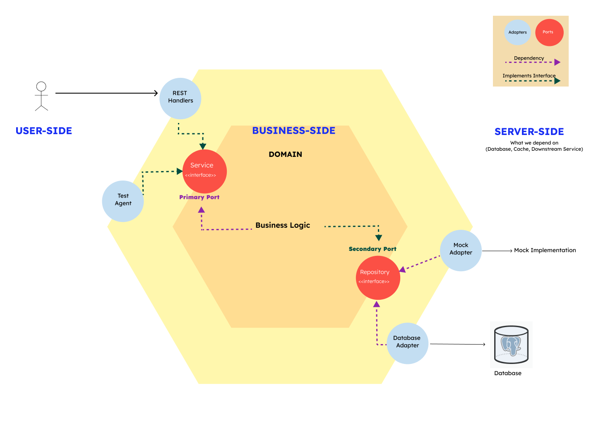
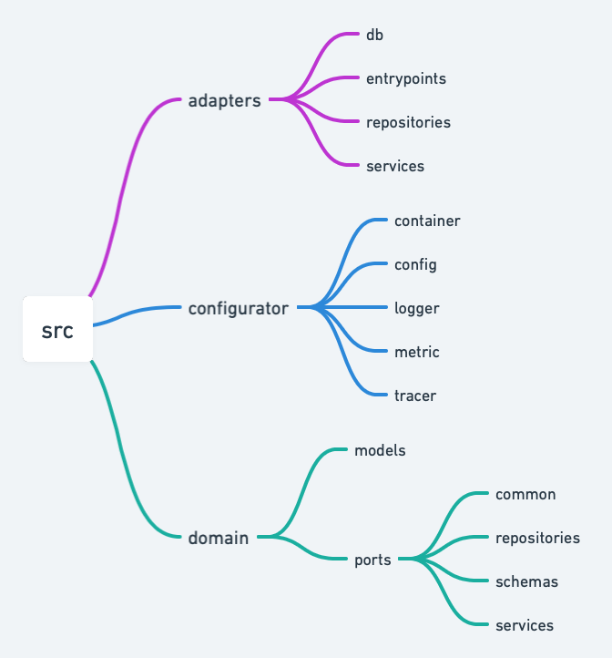

# FastAPI Hexagonal Architecture - WIP - Work In Progress

Rewritten version of: [Banking](https://github.com/akshanshgusain/Hexagonal-Architecture)

## About Hexagonal Architecture

You can read it from original author:

[The Pattern: Ports and Adapters](https://alistair.cockburn.us/hexagonal-architecture/)

### Why Hexagonal?

Hexagonal architecture, or ports and adapters architecture, stems from the work of Alistair Cockburn. 
It’s an architectural pattern used for designing software applications. With hexagonal architecture, 
we put our inputs and outputs at the edge of our design. This allows us to isolate the central logic 
of the application from the outside world. Since our inputs and outputs are on the edge, we can switch 
their handlers without affecting our core code.

### Core Principles
* Explicitly separates the code into three large areas.
    * 1. The `USER SIDE`/`LEFT SIDE` responsible for driving the application, the actors
        on this side drive the application logic. e.g., UI, HTTP Routes.
    * 2. The `BUSINESS SIDE`/ `CENTER` contains all the code that concerns/implements the
  business logic.
    * 3. The `SERVER SIDE`/ `RIGHT SIDE` contains the essential infrastructure details, such as 
        the code that interacts with the DB or to the mocks, or any other web service.

* The dependencies go inside. The rule here is that one who is triggering has to know the 
    dependency. The business logic does not depend on the user-side and similarly the business logic
 does not depend on the server side. The `SERVER-SIDE` depends on the `BUSINESS LOGIC`.

* The boundaries are isolated with interfaces. The ports are defined at the boundaries
of the business logic on which all kind of adapters can be interchangeably connected
if they follow the specification defined by the `PORT`.

---

* The application layer is represented as a hexagon. Within the hexagon, we have our domain entities and
the use cases that work with them. As we can see, there are no outgoing dependencies. All of our 
dependencies point towards the center. The inside of the hexagon, or the domain, depends on nothing
but itself. This ensures that the business logic is separated from the technical layers. It also 
ensures that we can reuse the domain logic. If we change our stack, it will have no impact on the 
domain code. The core holds the primary business logic and business rules

* Outside the hexagon, we see different adapters that interact with our application. Different adapters
will interact with different aspects of the application. For example, we could have a web adapter that
interacts with a web browser, some adapters that interact with external systems, and an adapter that 
interacts with a database. The adapters on the left side drive our application because they call our 
application core. The adapters on the right side are driven by our application because they are called
by our application core.

* Adapters are either external APIs of your application or clients to other systems. Adapters use ports to
initiate interaction with the application. A REST controller would be an example of an adapter. The 
application core provides ports so it can communicate with the adapters. Ports allow us to plug the
adapters into the core domain. We can think of ports as agnostic entry points.

### PROS
* `Maintainability`: Our applications have high maintainability because changes in one area of our application don’t affect other areas.
* `Flexibility`: We can easily switch between different applications, and we can add new adapters without changing the source code.
* `Simple testing`: Since our code is separated from the implementation details of the outside, we can test in isolation.
* `Agnostic`: Since the application is independent of external services, we can develop the inner core before building external services.

### CONS
* `Decoupling`: The performance of our application could be affected because of intermediate classes.
* `Debugging`: It can sometimes be hard to understand and debug adapters.
* `Complex`: Hexagonal architecture can sometimes be confusing because it’s not always obvious what we should consider to be on the outside.

## Project folder structure

